--- 
title: Mecanização Agrícola
subtitle: Técnicas para controle de qualidade nas operações mecanizadas
author: Rafael Tieppo 
date:
--- 

# Técnicas para controle de qualidade nas operações mecanizadas

## Ferramentas da qualidade

### Introdução

- Artesão controla a qualidade do processo? \pause
    - Produto Único

. . . 

- Contato entre artesão e cliente (**DIRETO**)
    - Permite certo controle de qualidade
    - Se o artesão não for bom, perde cliente
    
. . . 

- Atualmente
    - Máquina $\rightarrow$ Produto $\rightarrow$ Cliente

### Introdução

- Se é aplicado na indústria, por que não aplicar na **Agricultura**?

. . . 

- O que nos leva a controlar a qualidade?

> Necessidade das empresas se tornarem competitivas, tendo como
> consequência a busca de um modelo de produção que garanta
> sobrevivência.

### Ferramentas da qualidade

- Brainstorming
- Fluxograma
- Diagrama Ishikawa
- Histograma
- Gráfico de barras
- Pareto
- PDCA
- 5W + 2H
- 5 S
- Controle estatístico do processo (**CEP**)

## Ferramentas da Qualidade

### Brainstorming

{width=6cm}

\tiny{Icons made by www.flaticon.com}

### Fluxograma

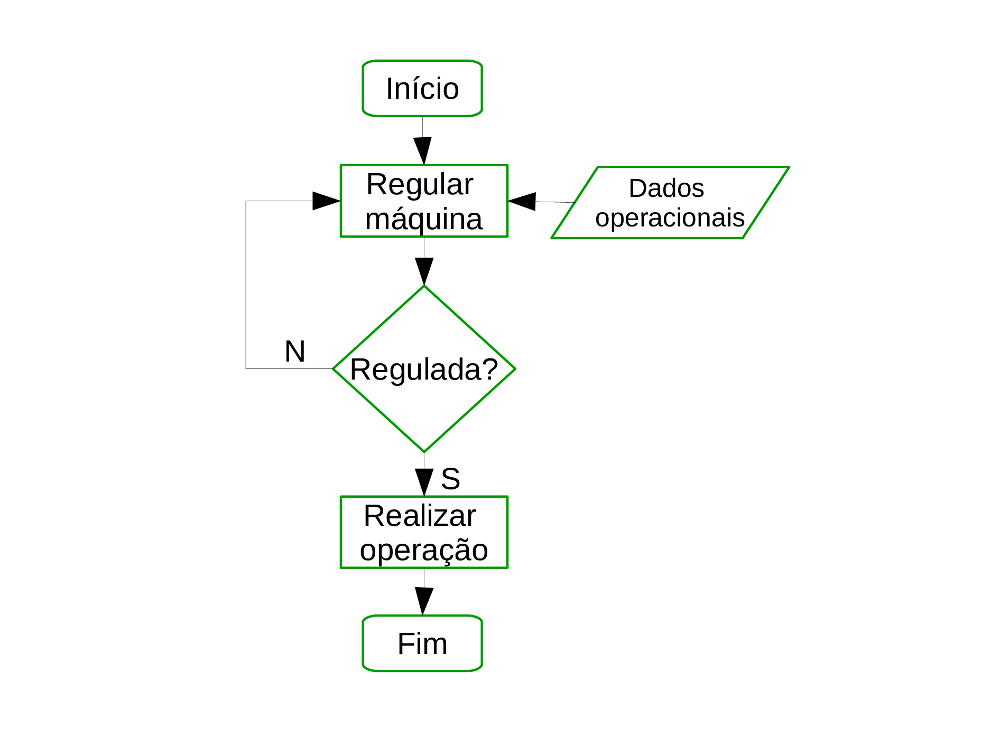{width=8cm}

### Diagrama Ishikawa

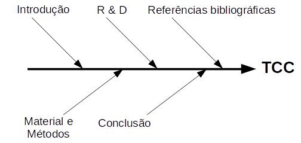{width=8cm}

### Histograma

> Indicador de frequência na forma gráfica

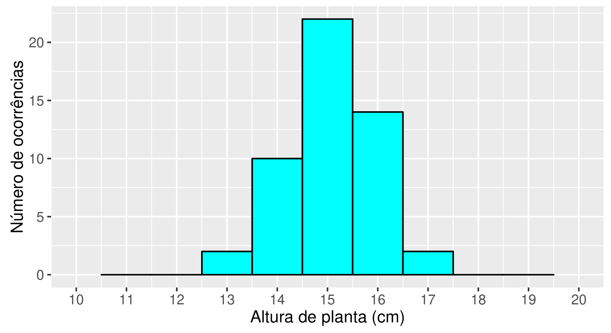{width=8cm}

### Histograma

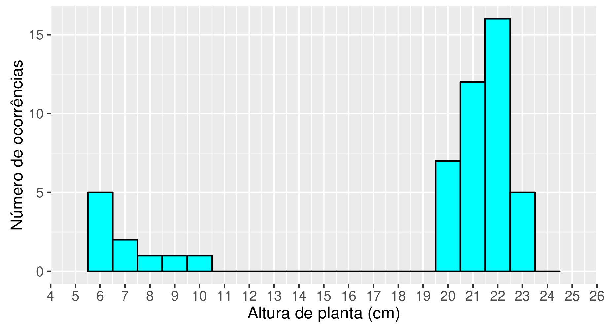{width=8cm}

###  Gráfico de barras

Quando usar gráfico de barras?

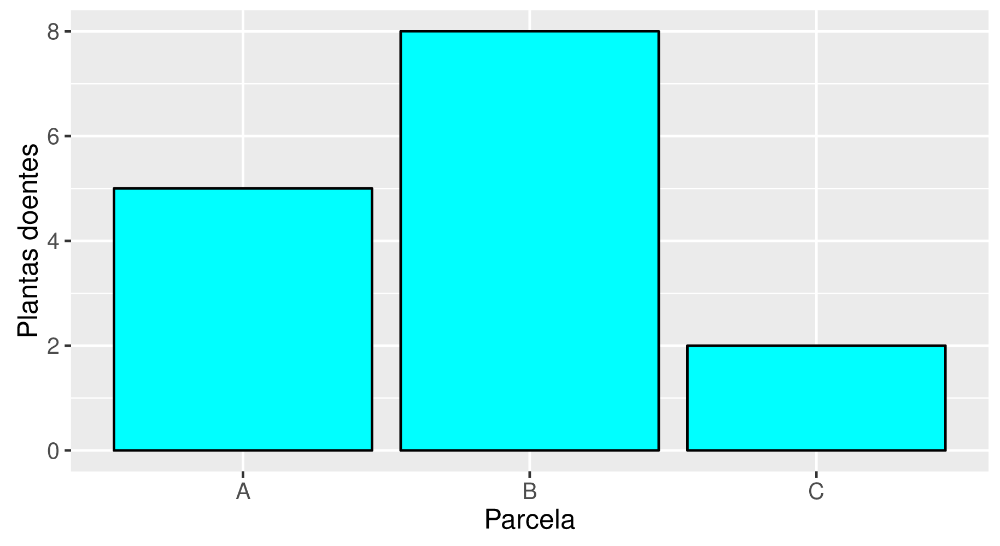{width=8cm}

### Pareto

\Huge{80/20}

\normalsize{}

- Vilfredo Pareto
- Estudo de proprietários de áreas agrícolas na Itália

### Diagrama de Pareto

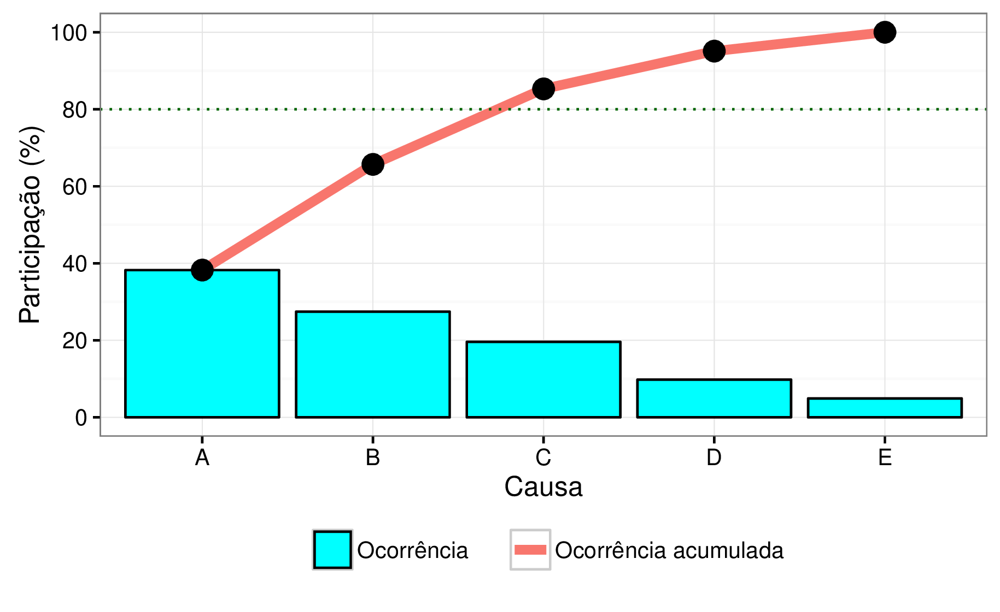{width=8cm}

\tiny{A = Ferrugem; B = Lagarta; C = Nematóide; D = Antracnose; E = Mancha foliar}

### PDCA

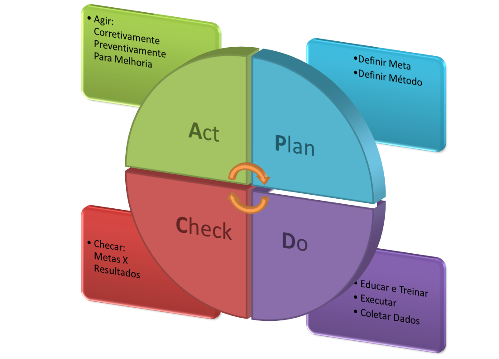{width=8cm}

### 5W + 2H

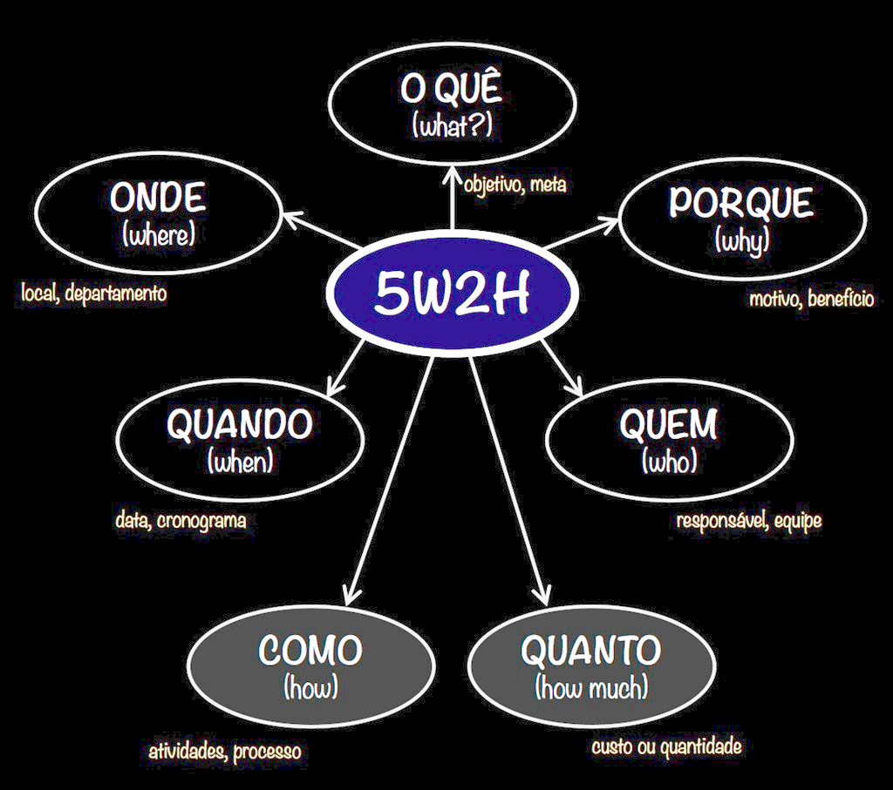{width=8cm}

### Conceito 5 S

> Aprender 5S é como "reaprender" o que é natural. Podemos nos inspirar
> no nosso corpo para cuidar do mundo em que atuamos. 

> A natureza do 5S é semelhante à natureza dos seres vivos

Fonte: \href{http://5s.com.br}{http://5s.com.br}

### Conceito 5 S - os cinco sensos

\small{}

| Senso          | Comando                                                         |
|----------------|-----------------------------------------------------------------|
| Utilização     | Separar o que é útil do que não é. Melhorar o uso do que é útil |
| Ordenação      | Um lugar para cada coisa. Cada coisa no seu lugar               |
| Limpeza        | Limpar e evitar sujar.                                          |
| Saúde          | Padronizar as práticas saudáveis                                |
| Autodisciplina | Assumir a responsabilidade de seguir os padrões saudáveis       |
|                |                                                                 |

### Controle estatístico do processo (**CEP**)

Considera-se que um processo está sob controle estatístico quando a
única fonte de variação são causas comuns (aleatórias).

\begin{columns}
   \begin{column}{5.5cm}
   \begin{alertblock}{Causa aleatória}
   \begin{itemize}
   \item Precisão da máquina
   \item Variabilidade solo
   \end{itemize}
   \end{alertblock}
   \end{column}
   \begin{column}{5.5cm}
   \begin{alertblock}{Causa especial}
   \begin{itemize}
   \item Elemento desgastado
   \item Operador sem treinamento
   \end{itemize}
   \end{alertblock}
   \end{column}
\end{columns}

### Gráfico de controle

> Como controlar seu processo?

. . . 

> Através dos gráficos de controle torna-se possível visualizar o
> comportamento das ações realizadas em um determinado processo.

### Gráficos de controle

\color{red}Assumindo que as causas especiais estejam eliminadas, deve-se definir alguns termos:

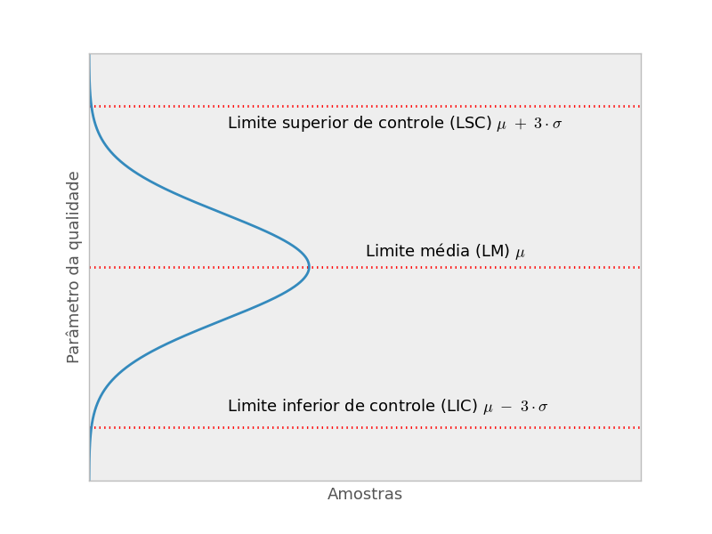{width=6.5cm}

### Classificação de gráficos de controle

- Gráfico de controle por **Variáveis**
    - Utilizado para controlar valores contínuos da qualidade de um
    produto ou serviço, (e.g. comprimento, massa, profundidade)
    
. . .

- Gráfico de controle por **Atributo**
    - Utilizado quando se trabalha comparando atributos (e.g. fração com
    defeito, defeitos por produto, falhas por serviço)

### Gráfico de controle por VARIÁVEIS

$\mu$ é a média aritimética da população $\rightarrow$ estimada pela
média das médias amostrais ($\bar {\bar x}$)

$\delta$ é o desvio padrão da população $\rightarrow$ estimado pela
média dos desvios amostrais ($\bar S$)

$\therefore$

Linha média $=~\bar{\bar{x}}$

- Limite de controle pelo desvio padrão:

Linha de controle $=~\bar{\bar{x}}~\pm~A1~\cdot~(\bar{S})$, em que $\bar
S$ é o desvio da população estimado pela **média do desvio padrão**
amostral, $A1$ é um fator de ajuste

### Gráfico de controle

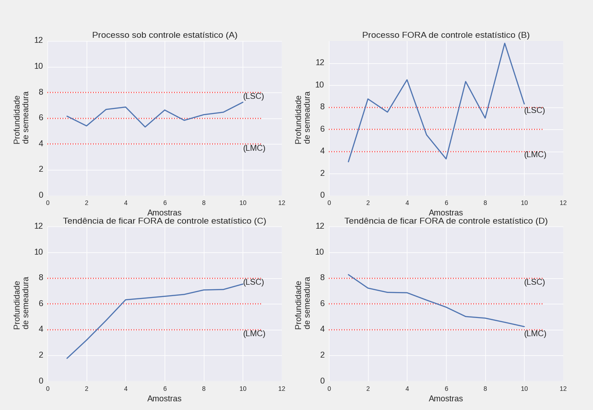{width=9cm}

### Gráfico de controle com problemas

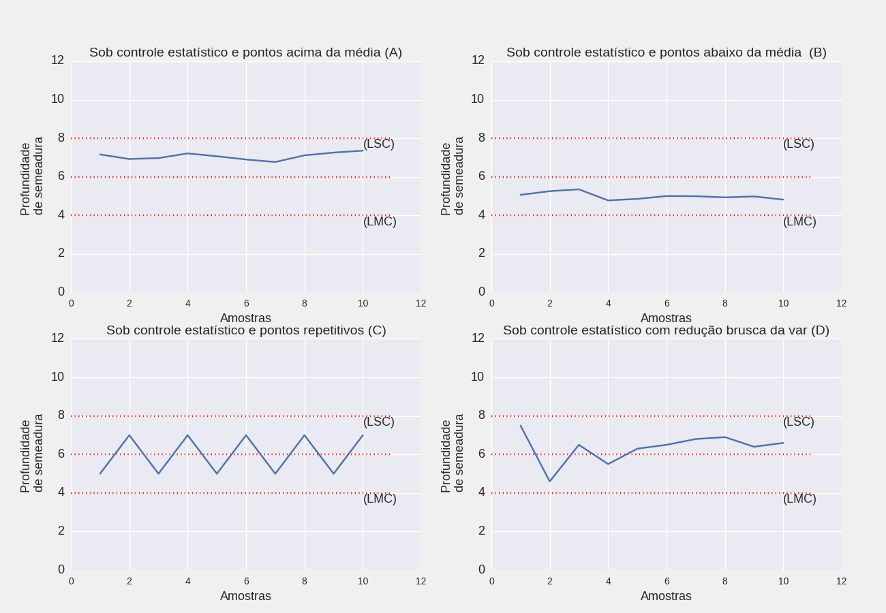{width=9cm}

### Exemplo

Profundidade de semente após a operação de semeadura:

\small{}

|   AMOSTRA |   M1 |   M2 |   M3 |   M4 |
|-----------|------|------|------|------|
|         1 |   60 |   70 |   55 |   65 |
|         2 |   50 |   60 |   70 |   60 |
|         3 |   60 |   70 |   75 |   65 |
|         4 |   60 |   50 |   55 |   55 |
|         5 |   60 |   50 |   65 |   65 |
|         6 |   50 |   65 |   65 |   70 |

\normalsize{}

### Gráfico de controle por VARIÁVEIS - exemplo

\small{}

| Amostra | M1 | M2 | M3 |    M4 | AMPLITUDE | MEDIA |   SD |
|---------|----|----|----|-------|-----------|-------|------|
|       1 | 60 | 70 | 55 |    65 |        15 |  62.5 | 6.45 |
|       2 | 50 | 60 | 70 |    60 |        20 | 60.00 | 8.16 |
|       3 | 60 | 70 | 75 |    65 |        15 |  67.5 | 6.45 |
|       4 | 60 | 50 | 55 |    55 |        10 | 55.00 | 4.08 |
|       5 | 60 | 50 | 65 |    65 |        15 | 60.00 | 7.07 |
|       6 | 50 | 65 | 65 |    70 |        20 | 62.50 | 8.66 |
|         |    |    |    | Média |     15.83 | 61.25 | 6.81 |

\normalsize{}

### Gráfico de controle por VARIÁVEIS - exemplo

Com o número de medições ($n$) verifica-se o valor de $A1$ nas Tabelas
(Apêndice).

- Limites de media pelo desvio padrãoComo tem-se n=4 
    - A1 = 1.5
    - Limites da media pelo desvio padrão: LIC = 51.02 ; LMC = 61.25 ; LSC
      = 71.47

- Limites de dispersão pelo desvio padrão
    - B3 = 0
    - B4 = 2.266
    - Limites da dispersão pelo desvio padrão: LIC = 0.0 ; LMC =
      6.81 ; LSC = 15.44

### Gráfico de controle por VARIÁVEIS - exemplo

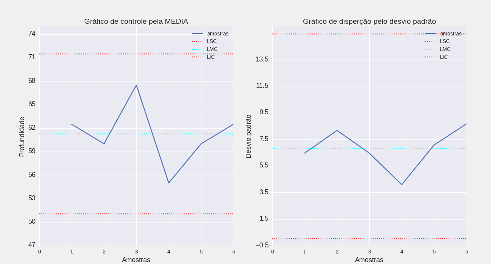{#fig:figqccexemp} 


### Exemplo código 


```Python
plt.figure(figsize=(9, 5))
plt.hist(df_plant['FORCA_LINHA_KN'], color='cyan',
     edgecolor='black',
     bins=np.arange(0.5, 6, 0.5),
     align='mid', alpha=0.6)
plt.xticks(np.arange(0.5, 6, 0.5), fontsize=13)
plt.xlabel('Força por linha (kN)', fontsize=13)
plt.ylabel('Número de observações', fontsize=13)
plt.tight_layout()
plt.show()
```

## Agradecimentos

### Obrigado

Icons made by <a href="https://www.flaticon.com/free-icon/brainstorm_2421218?related_item_id=2421205&term=brainstorm" title="wanicon">wanicon</a> from <a href="https://www.flaticon.com/" title="Flaticon">www.flaticon.com</a>

## References

### Referências


